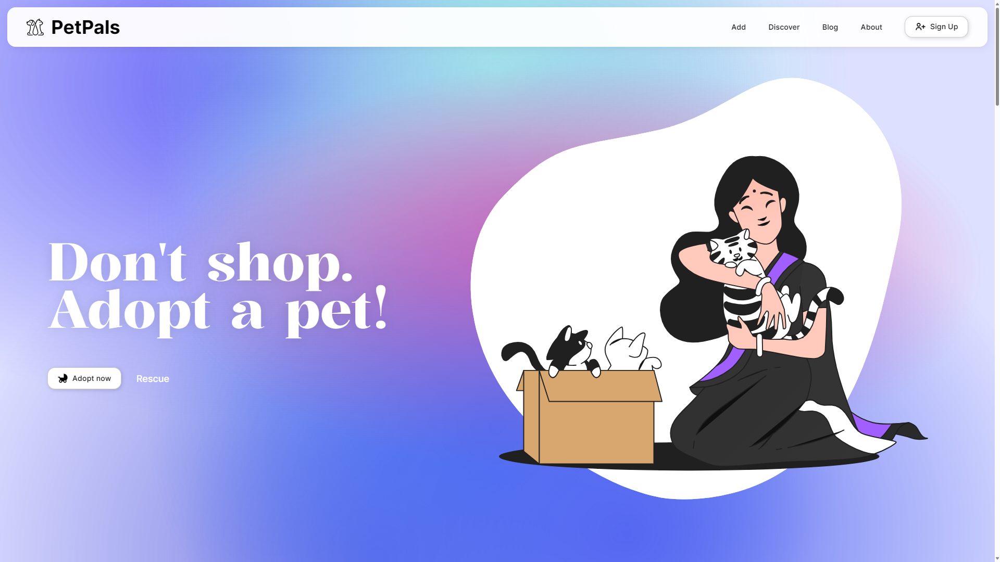
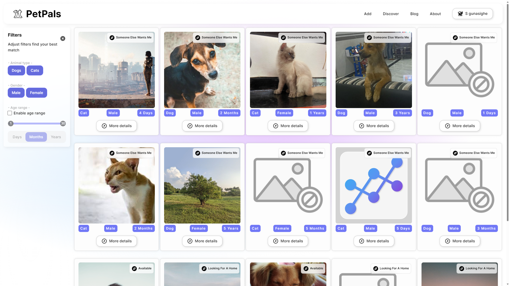
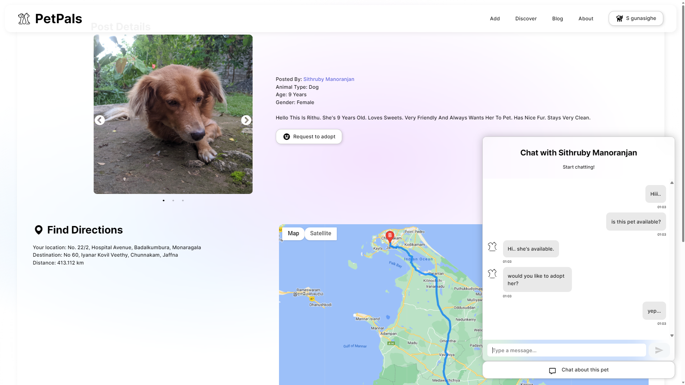

# **PetPals**

PetPals is a web app designed to find and adopt homeless pets.

&nbsp;

&nbsp;

&nbsp;

### Built and deployed with

&nbsp;

### Background

In Sri Lanka, the rising population of stray animals is a pressing concern that demands our attention. Abandoned and often left to suffer, these animals deserve a brighter future. Our proposal outlines a dedicated web platform designed to connect potential adopters, compassionate rescuers, and shelters. ‘PetPals’ project not only streamlines rescue and rehoming processes for stray animals and pets searching for a new home, but also fosters community responsibility. Our mission is to reduce the suffering of stray animals and create a more compassionate society.

### Proposed system design

1. **User Registration and Profiles:** Allows users to create accounts with secure authentication methods.
2. **Animal Registration and Management:** Ability to register and manage animals and create comprehensive profiles for each animal, including details about their health, location and, images.
3. **Search and Filtering Algorithms:** Users can filter and search for animals based on various criteria, such as species, age, location, and gender.
4. **Secure Communication and Messaging:** Includes secure messaging features to facilitate
   communication between potential adopters and rescuers.
5. **Educational Resources:** To promote responsible pet ownership and animal welfare, the system will
   offer a collection of educational resources.

### Goals

1. **Increased Adoption Rates:** Anticipate a significant increase in the adoption rates of stray animals in Sri Lanka.
2. **Reduction in Stray Animal Suffering:** Alleviate the suffering of animals by providing them with safe and loving environments.
3. **Efficient Rescue Operations:** Streamline the process of rescuing and managing stray animals.
4. **Community Engagement:** Community involvement and responsibility regarding stray animal welfare.
5. **Economic Savings:** Economic savings for communities by reducing the burden on animal shelters and public resources.

### Contributors

#### Development team:

|                                                                                                                          |                                                                                                                       |                                                                                                                             |                                                                                                                             |
| :----------------------------------------------------------------------------------------------------------------------: | :-------------------------------------------------------------------------------------------------------------------: | :-------------------------------------------------------------------------------------------------------------------------: | :-------------------------------------------------------------------------------------------------------------------------: |
|  <a href="https://github.com/samadhi1311">samadhi1311</a> |     <a href="https://github.com/dineth88">dineth88</a>    |   <a href="https://github.com/kamsha-ravi">kamsha-ravi</a>   |           <a href="https://github.com/saji56">saji56</a>          |
|       <a href="https://github.com/kajinada">kajinada</a>     |  <a href="https://github.com/dprabodhya">dprabodhya</a> |  <a href="https://github.com/puresoul1702">puresoul1702</a> |  <a href="https://github.com/mohamedsimar">mohamedsimar</a> |

#### Special thanks to:

|                                                                                                                |                                                                                                                                     |                                                                                                             |                                                                                                                |                                                                                                                            |
| :------------------------------------------------------------------------------------------------------------: | :---------------------------------------------------------------------------------------------------------------------------------: | :---------------------------------------------------------------------------------------------------------: | :------------------------------------------------------------------------------------------------------------: | :------------------------------------------------------------------------------------------------------------------------: |
|  <a href="https://github.com/sithruby">sithruby</a> |  <a href="https://github.com/radeeshanuka123">radeeshanuka123</a> |  <a href="https://github.com/vini070">vini070</a> |  <a href="https://github.com/sankavi5">sankavi5</a> |  <a href="https://github.com/nipunigamage">nipunigamage</a> |

